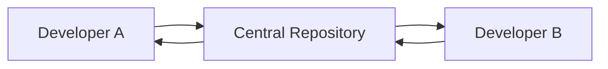
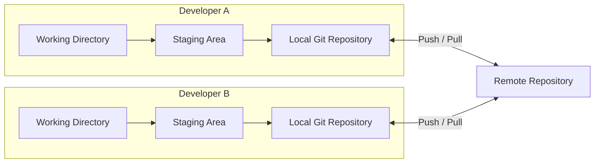
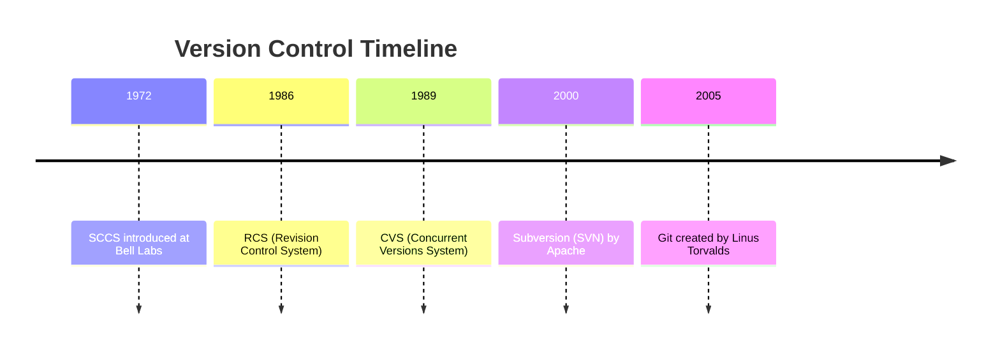
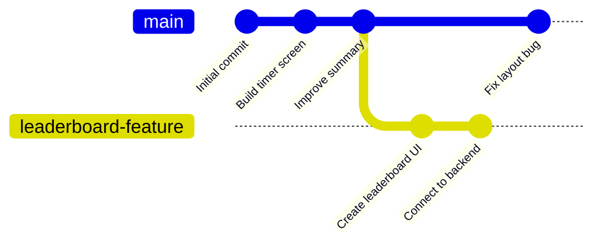

title: GIT Basics

### Version Control Systems

A **Version Control System (VCS)** is a software tool that tracks and manages changes to files, allowing multiple versions of the same file to exist over time. It enables developers to collaborate, revert to previous states, examine changes, and maintain a historical record of a project’s evolution.

The fundamental purpose of a VCS is to prevent loss of work, support collaboration, and maintain an authoritative history of changes. Each change is typically recorded with metadata such as the author, timestamp, and a message describing the change.

---

### Early Forms of Version Control (Before Git)

Prior to Git and modern distributed systems, version control was centralized. The most notable tools included **CVS (Concurrent Versions System)** and **Subversion (SVN)**. In these systems, there existed a **central repository** which all users would connect to for updates and commits.

In centralized version control:

- The repository is stored on a **central server**.
- Developers pull the latest changes and push their own changes to the central server.
- A connection to the central server is required for most operations.
- There is no complete history available locally unless explicitly requested.

This approach had several limitations:

1. The central server is a single point of failure.
2. Offline development is difficult or impossible.
3. Merging branches was cumbersome and error-prone.

---

### Git and Distributed Version Control

Git introduced a **distributed model** of version control. Every developer has a **complete copy** of the repository, including the full history, branches, and tags.

This model has several advantages:

- Each clone is a full backup of the repository.
- Most operations are local, making Git very fast and usable offline.
- Branching and merging are core design features and are highly efficient.
- Collaboration is more flexible, allowing developers to commit independently and synchronize later.

Git also introduced a **content-addressable storage model**, where each file and commit is hashed (usually using SHA-1), ensuring integrity and traceability.

---

### Summary of Key Differences

| Feature                     | Centralized VCS (CVS/SVN)         | Distributed VCS (Git)        |
|----------------------------|-----------------------------------|------------------------------|
| Repository location        | Central server                    | Every user has full copy     |
| Offline work               | Limited                           | Fully supported              |
| Speed                      | Dependent on network              | Mostly local and fast        |
| Collaboration              | Serial / lock-based               | Parallel / merge-based       |
| Resilience                 | Server is single point of failure | Fully distributed backups    |
| Branching and Merging      | Manual and slow                   | Lightweight and fast         |

---

### Evolution of Version Control

Each phase marked a progression in how collaboration and code integrity were handled, culminating in the robust and distributed systems used today.

### A Conceptual Walkthrough: How Git Works in Real Projects

---

#### 📱 Imagine You're Building an App

You and your team are building a simple mobile application — let’s call it `FocusMate`, an app that helps users track deep work sessions. You begin with a basic prototype: a home screen, a start timer button, and a summary page.

---

### 🕰️ Version Control — The Old Way (Delta-Based Systems)

In older version control systems like CVS or Subversion (SVN), every time you made a change, the system stored **just the difference** — a *delta* — from the last version. These deltas were sequential:

> Version 1 → Version 2 = changes in 3 lines  
> Version 2 → Version 3 = changes in 2 lines  
> …

Every new version had to be **reconstructed** by applying a sequence of diffs to the original, like flipping through changes in a flipbook.

This had problems:

- To understand what the current version looks like, the system had to **replay every change** from the beginning.
- Collaboration was hard. Two people changing the same file? Conflicts.
- Testing a new feature? You'd make a **manual copy** of the folder.
- Releasing version 1.0? You’d **zip the whole project** and save it elsewhere.

---

### 📸 Git Works Differently: Snapshots, Not Diffs

Git changed everything.

Instead of tracking changes line-by-line, Git thinks in **snapshots**. At every commit, Git stores a complete picture of what the entire project looks like — not by copying every file again, but by **referencing** files that haven’t changed and **storing only the new ones**.

Imagine every commit as a full photograph of your project at a moment in time. Files that remain unchanged just get reused from previous snapshots — so Git remains fast and efficient.

---

### 🔄 Git Enables Modern Development

Let’s return to your app project.

#### 🧱 Phase 1: Initial Commit

You build the timer screen and commit your code. Git saves a snapshot. That becomes your base.

#### 🌱 Phase 2: Add a New Feature → Create a Branch

Now you want to add a leaderboard — but it’s experimental.  
Instead of risking your stable code, you create a **branch** called `leaderboard-feature`.  
This is a **parallel timeline**, isolated from the main app.

You work on the feature. You break some things. You fix them.  
Meanwhile, your teammate is improving the summary screen on the `main` branch.

No one steps on anyone else’s toes.

---

#### 🧪 Phase 3: Testing and Isolated Work

The `leaderboard-feature` branch is tested independently.

If it fails, you can delete the branch.  
If it succeeds, you can **merge** it into `main`.

Git keeps the history — not just that the feature exists, but *how* it was built, tested, and finalized.

---

#### 🔀 Phase 4: Merging

After testing, you decide to bring the feature into the main line.  
Git analyzes both timelines and **merges** them.

If two people changed the same file, Git will try to resolve it automatically — or tell you exactly what needs attention.

The result is a **unified, updated snapshot** that now includes all the new work.

---

#### 🚀 Phase 5: Deployment

You tag a specific commit as `v1.0` — a marker in the graph.  
You can now deploy that version, go back to it anytime, or build upon it.

If users report a bug, you can create a new branch called `bugfix-crash-on-timer`, fix the issue there, test it independently, and merge it back cleanly — all without disturbing other development work.

---

### 🧠 Why Git’s Model is Powerful

- You can work on multiple features *simultaneously* in isolated timelines
- Switching between versions takes **milliseconds**
- Historical states are **immutable** — no corruption
- Testing and experimentation becomes **safe**
- Releases are **precise** and reproducible
- Collaboration is seamless — developers don’t overwrite each other’s work

---

Git is not just a tool to store code. It’s a system that reflects the **real dynamics of creative work**: parallel ideas, experimentation, review, and assembly.

Would you like me to now follow this with the underlying object model (blobs, trees, commits) showing how Git internally tracks this evolution with content hashes?