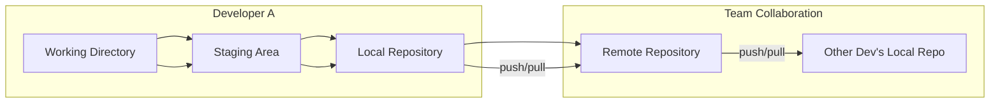

title: GIT Basics

At the heart of modern software development lies **version control**, a system that tracks and manages changes to a codebase over time. In a world where multiple developers are constantly modifying and enhancing software, keeping a detailed and structured **history of changes** is not a luxury—it is a necessity. This is where **Git**, a distributed version control system, plays a foundational role.

Git was designed by Linus Torvalds in 2005 with a clear goal: **to track changes in source code while being fast, distributed, and secure**. Every snapshot of a project in Git is not a diff or patch; it is a **complete snapshot of the entire directory tree** (only changes are compressed internally using a mechanism based on SHA-1 hashes, ensuring both uniqueness and integrity). This makes retrieving the exact state of a project at any point in history seamless and reliable.

In practical terms, developers use Git to:

- **Record the complete history** of every file in the project.
- **Travel backward and forward in time** to see the evolution of the code, understand when bugs were introduced, or recover lost versions.
- **Work independently** on new features, experiments, or bug fixes in isolated branches without affecting the stable version of the project.
- **Integrate code from many contributors**, resolve conflicts where changes overlap, and review the evolution of each line of code.

This leads us naturally into Git’s importance for **collaboration**. In traditional workflows, when developers tried to work on the same files, **overwriting each other’s changes was a constant threat**. Emailing files back and forth, renaming with suffixes like `final_v3_really_final.cpp`, or using centralized systems where only one person could work on a file at a time, were brittle and error-prone.

Git changes that. It provides a **branching model** where each developer works in their own **sandbox**. These branches can later be **merged**, and if conflicting changes are made to the same parts of a file, Git intelligently notifies the user and requests **manual resolution**. The entire collaboration becomes traceable: who changed what, when, and why. With platforms like GitHub, GitLab, and Bitbucket building on top of Git, it’s now standard to review code changes via **pull requests** or **merge requests**, comment on them, and track their discussion and eventual integration into the main project.

Moreover, Git is **distributed**. Each developer has a complete copy of the repository, including the entire history. This means you can work offline, commit locally, inspect logs, and even restore deleted code—all without needing a central server. Only when you're ready to share or integrate do you push to or pull from a remote repository.

Let us visualize Git’s model briefly to understand its advantage:

This model shows that every developer has their **own isolated history and workspace**, and only deliberate synchronization is performed with the shared remote.

In summary, Git is not just a tool—it is a **discipline and infrastructure** that supports the entire life cycle of software development. It **solves the problems of loss, duplication, confusion, and untraceability**. It replaces chaotic file-sharing with an elegant graph of commits and branches. And it enables developers to collaborate asynchronously and safely, providing the **backbone of team productivity and confidence** in the software they build.