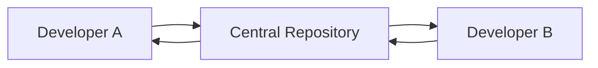
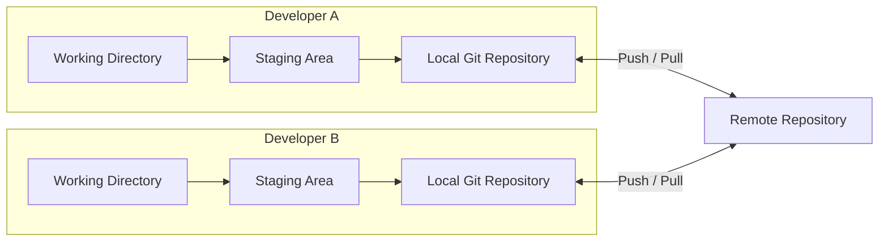
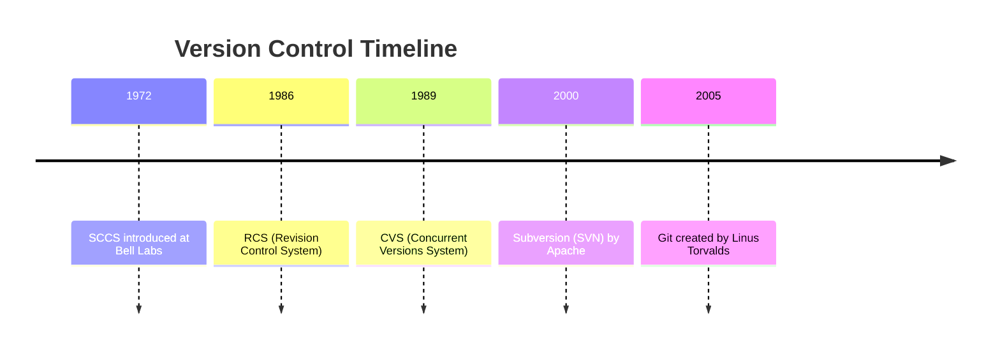
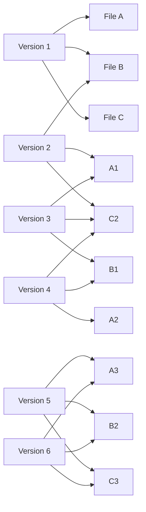
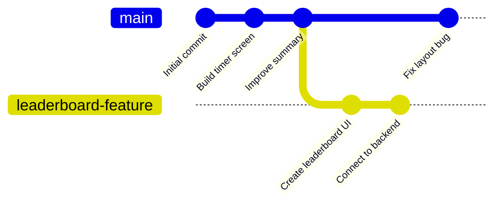
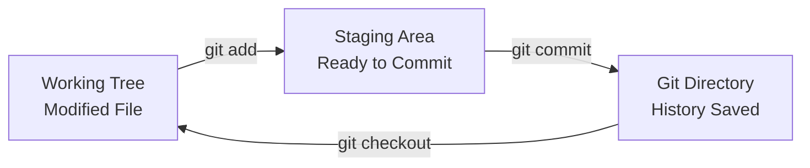
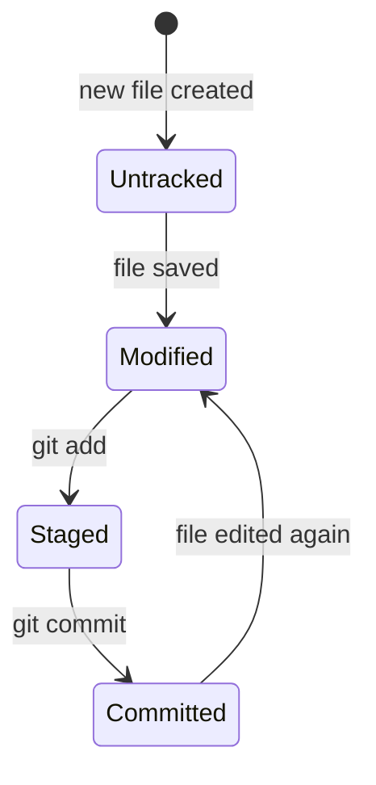

title: GIT Basics

## Version Control Systems

A **Version Control System (VCS)** is a software tool that tracks and manages changes to files, allowing multiple versions of the same file to exist over time. It enables developers to collaborate, revert to previous states, examine changes, and maintain a historical record of a project’s evolution.

The fundamental purpose of a VCS is to prevent loss of work, support collaboration, and maintain an authoritative history of changes. Each change is typically recorded with metadata such as the author, timestamp, and a message describing the change.

---

## Early Forms of Version Control (Before Git)

Prior to Git and modern distributed systems, version control was centralized. The most notable tools included **CVS (Concurrent Versions System)** and **Subversion (SVN)**. In these systems, there existed a **central repository** which all users would connect to for updates and commits.

In centralized version control:

- The repository is stored on a **central server**.
- Developers pull the latest changes and push their own changes to the central server.
- A connection to the central server is required for most operations.
- There is no complete history available locally unless explicitly requested.

This approach had several limitations:

1. The central server is a single point of failure.
2. Offline development is difficult or impossible.
3. Merging branches was cumbersome and error-prone.

---

## Git and Distributed Version Control

Git introduced a **distributed model** of version control. Every developer has a **complete copy** of the repository, including the full history, branches, and tags.

This model has several advantages:

- Each clone is a full backup of the repository.
- Most operations are local, making Git very fast and usable offline.
- Branching and merging are core design features and are highly efficient.
- Collaboration is more flexible, allowing developers to commit independently and synchronize later.

Git also introduced a **content-addressable storage model**, where each file and commit is hashed (usually using SHA-1), ensuring integrity and traceability.

---

#### Summary of Key Differences

| Feature                     | Centralized VCS (CVS/SVN)         | Distributed VCS (Git)        |
|----------------------------|-----------------------------------|------------------------------|
| Repository location        | Central server                    | Every user has full copy     |
| Offline work               | Limited                           | Fully supported              |
| Speed                      | Dependent on network              | Mostly local and fast        |
| Collaboration              | Serial / lock-based               | Parallel / merge-based       |
| Resilience                 | Server is single point of failure | Fully distributed backups    |
| Branching and Merging      | Manual and slow                   | Lightweight and fast         |

---

## Evolution of Version Control

Each phase marked a progression in how collaboration and code integrity were handled, culminating in the robust and distributed systems used today.

## A Conceptual Walkthrough: How Git Works in Real Projects

---

#### 📱 Imagine You're Building an App

You and your team are building a simple mobile application — let’s call it `FocusMate`, an app that helps users track deep work sessions. You begin with a basic prototype: a home screen, a start timer button, and a summary page.

---

### 🕰️ Version Control — The Old Way (Delta-Based Systems)

In older version control systems like CVS or Subversion (SVN), every time you made a change, the system stored **just the difference** — a *delta* — from the last version. These deltas were sequential:

> Version 1 → Version 2 = changes in 3 lines  
> Version 2 → Version 3 = changes in 2 lines  
> …

Every new version had to be **reconstructed** by applying a sequence of diffs to the original, like flipping through changes in a flipbook.

This had problems:

- To understand what the current version looks like, the system had to **replay every change** from the beginning.
- Collaboration was hard. Two people changing the same file? Conflicts.
- Testing a new feature? You'd make a **manual copy** of the folder.
- Releasing version 1.0? You’d **zip the whole project** and save it elsewhere.

---

### 📸 Git Works Differently: Snapshots, Not Diffs

Git changed everything.

Instead of tracking changes line-by-line, Git thinks in **snapshots**. At every commit, Git stores a complete picture of what the entire project looks like — not by copying every file again, but by **referencing** files that haven’t changed and **storing only the new ones**.

Imagine every commit as a full photograph of your project at a moment in time. Files that remain unchanged just get reused from previous snapshots — so Git remains fast and efficient.

---

### 🔄 Git Enables Modern Development

Let’s return to your app project.

#### 🧱 Phase 1: Initial Commit

You build the timer screen and commit your code. Git saves a snapshot. That becomes your base.

#### 🌱 Phase 2: Add a New Feature → Create a Branch

Now you want to add a leaderboard — but it’s experimental.  
Instead of risking your stable code, you create a **branch** called `leaderboard-feature`.  
This is a **parallel timeline**, isolated from the main app.

You work on the feature. You break some things. You fix them.  
Meanwhile, your teammate is improving the summary screen on the `main` branch.

No one steps on anyone else’s toes.

---

#### 🧪 Phase 3: Testing and Isolated Work

The `leaderboard-feature` branch is tested independently.

If it fails, you can delete the branch.  
If it succeeds, you can **merge** it into `main`.

Git keeps the history — not just that the feature exists, but *how* it was built, tested, and finalized.

---

#### 🔀 Phase 4: Merging

After testing, you decide to bring the feature into the main line.  
Git analyzes both timelines and **merges** them.

If two people changed the same file, Git will try to resolve it automatically — or tell you exactly what needs attention.

The result is a **unified, updated snapshot** that now includes all the new work.

---

#### 🚀 Phase 5: Deployment

You tag a specific commit as `v1.0` — a marker in the graph.  
You can now deploy that version, go back to it anytime, or build upon it.

If users report a bug, you can create a new branch called `bugfix-crash-on-timer`, fix the issue there, test it independently, and merge it back cleanly — all without disturbing other development work.

---

### 🧠 Why Git’s Model is Powerful

- You can work on multiple features *simultaneously* in isolated timelines
- Switching between versions takes **milliseconds**
- Historical states are **immutable** — no corruption
- Testing and experimentation becomes **safe**
- Releases are **precise** and reproducible
- Collaboration is seamless — developers don’t overwrite each other’s work

---

Git is not just a tool to store code. It’s a system that reflects the **real dynamics of creative work**: parallel ideas, experimentation, review, and assembly.

### Git Generally Only Adds Data

Git is designed in such a way that almost everything you do with it **adds** data to the database. It **very rarely deletes** anything. This is one of the biggest reasons developers trust Git: once a change is **committed**, it is very hard to lose.

For example, suppose you're writing a file called `chapter1.txt`. You make changes to it, save the file, and then commit it using Git. That commit becomes a **snapshot** — a permanent record. Even if you later change or delete that file, Git still keeps the original version in the history. You can always go back and recover it.

You can still lose changes **you haven’t committed yet** (such as unsaved edits in your code editor or changes you made but didn’t `git add` and `git commit`). But once you’ve made a commit, that data is saved inside Git’s internal database.

If you also **push** your repository to a remote server like GitHub, your work is doubly safe: it’s saved on your computer **and** backed up somewhere else.

---

### The Three States of a File in Git

Every file tracked by Git lives in **one of three states** at any given time:

1. **Modified**  
   You’ve changed the file, but Git doesn’t know yet what you want to do with it. It’s just sitting in your working directory, different from what Git has saved last time.

2. **Staged**  
   You told Git, “I want to save this version of the file next time I make a snapshot.” You do this using the `git add` command. Git now knows exactly which version of the file to include in the next commit.

3. **Committed**  
   The file is saved forever in Git’s database. You used `git commit`, and Git took a snapshot of the staged version of the file.

---

### Real-World Example

Suppose you're working on a file called `notes.txt`.

- You write a new paragraph.  
  Now it's **modified**.
  
- You run `git add notes.txt`.  
  Now it’s **staged**.

- You run `git commit -m "Added intro paragraph"`  
  Now it’s **committed**.

If you go back and write more, the file becomes **modified** again — and the cycle repeats.

---

### Git’s Three Areas: Where Your File Lives

Each of the above states happens in one of **three areas** that make up a Git project:

| Git Area        | Description                                                                 |
|------------------|------------------------------------------------------------------------------|
| **Working Tree** | This is where you edit files. It shows the current version of your project. |
| **Staging Area** | This is a middle place where you list what will go into your next commit.   |
| **Git Directory**| This is Git’s database. It holds all the history and snapshots you commit.  |

---

### How It Works Together

Here’s how Git moves your file through these three areas:

Let’s follow this with the `notes.txt` example:

- You change something in `notes.txt`. Now it’s modified in the **Working Tree**.
- You run `git add notes.txt`. Git copies that version into the **Staging Area**.
- You run `git commit`. Git writes that file’s snapshot into the **Git Directory** (the actual database).
- If needed, you can later restore that version into the **Working Tree** using `git checkout`.

---

### Table of File States and Commands

| File State  | Description                                           | Action to Move Forward      |
|-------------|-------------------------------------------------------|-----------------------------|
| Modified    | You changed the file but haven't told Git about it.   | `git add`                   |
| Staged      | File is ready for the next commit.                    | `git commit`                |
| Committed   | File is saved in Git's history permanently.           | `git checkout`, `git reset` |

---

### Diagram: States and Transitions

---

### Why This Is Powerful

Because Git stores each committed version like a snapshot, you can:

- Undo mistakes
- Recover deleted work
- Try new ideas safely
- Compare older versions
- Share changes with others
- Go back in time

Even if you mess something up, the committed versions are still there — and Git can help you get back to a clean state.

This model also makes Git safe and fast. Most operations happen **locally**, without needing internet or a server.

In the next section, you will learn how Git stores these committed snapshots using *objects* (blobs, trees, commits), and how they are connected in Git’s internal database.