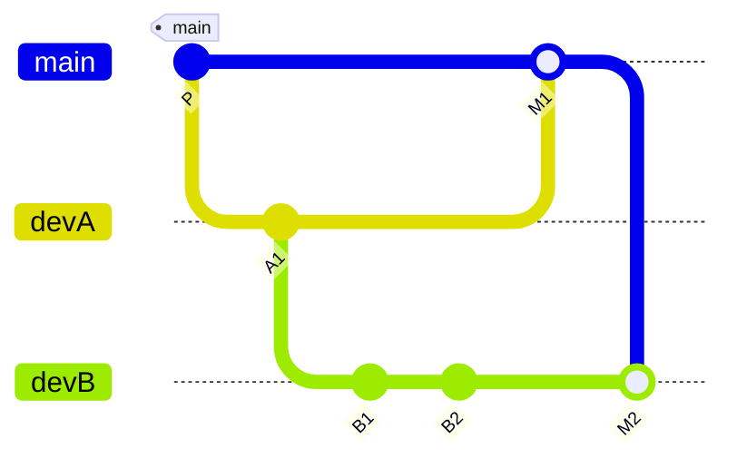

title: Merging and Rebasing

# 🔀 Git Branching Strategies: Merging vs Rebasing in Detail

Git offers two primary ways to integrate changes from one branch into another:

* `git merge`: combines histories while preserving their original structure.
* `git rebase`: re-applies your commits onto another base, rewriting history.

Each has unique effects on your repository and collaboration model. Understanding how they work and when to use which is critical for smooth Git workflows.

---

## 🧭 1. **What is Git Merge?**

### 📌 Command:

```bash
git merge branchA
```

### 🔍 Concept:

* You stay on `branchB`, and bring in all commits from `branchA`.
* Git creates a **merge commit** with two parents.
* The histories of both branches are preserved.

### 🌳 Example:

Suppose you are on `feature` and you merge `main` into it:

```bash
git checkout feature
git merge main
```

This brings all new commits from `main` into `feature`, producing a merge commit like this:

```text
*   M  ← merge commit
|\
| * C  ← latest on main
| * B
* | A  ← last commit on feature
|/
* P   ← common ancestor
```

---

## 🔄 2. **What is Git Rebase?**

### 📌 Command:

```bash
git rebase main
```

This means: “Take all my current commits and replay them on top of `main`.”

### 🔍 Concept:

* Git finds the common ancestor of the two branches.
* Your commits are **rebased** (re-written with new parents) atop the tip of `main`.
* No merge commit is created.
* History becomes linear.

### 🌳 Example:

```bash
git checkout feature
git rebase main
```

```text
Before:
* A  ← on feature
|
* P  ← common ancestor
|
* B  ← on main

After:
* A'  ← rewritten version of A (based on B)
* B
* P
```

---

## 🔍 3. **Key Differences Between Merge and Rebase**

| Feature             | `git merge`                   | `git rebase`                       |
| ------------------- | ----------------------------- | ---------------------------------- |
| History             | Non-linear (shows divergence) | Linear (one path)                  |
| Commit Hashes       | Preserved                     | Rewritten                          |
| Conflict Resolution | Once during merge             | Once per commit if conflicts occur |
| Merge Commit        | Yes                           | No                                 |
| Safety (Collab)     | Safe for shared branches      | Dangerous on public branches       |
| Simplicity          | Easier to understand          | Cleaner history, but riskier       |

---

## ⚠️ 4. **Perils of Rebasing (Rewriting History)**

Rebase rewrites commits. **Never rebase a public branch that others may be using.**

### 🔥 Problem:

If you rebase and force-push a branch that others already pulled from, they will get duplicate commits and face **divergent history**, resulting in:

* Duplicate commits
* Conflicts when they try to push
* Broken CI/CD if it runs on a stale branch

### 💡 Rule of Thumb:

> Only rebase **your own local, unpublished** branches.

Use `git merge` for shared/public branches.

---

## 🤝 5. **Collaborative Workflow Example: Two Developers**

### Scenario:

* Both developers branch off `main`.
* Dev A makes commit `A1`, Dev B makes `B1`, `B2`.
* Dev A merges into `main`, Dev B now needs to sync.

Let’s visualize this with **Mermaid**.

---

### 📊 **Mermaid Diagram: Merge Flow**



💡 Here:

* Dev A merges first.
* Dev B merges updated main into their branch to get A’s work.
* Final `git merge devB` brings everything into main.

---

### 📊 **Mermaid Diagram: Rebase Flow**


💡 Here:

* Dev A merges as before.
* Dev B rebases on top of updated `main` (including A1).
* Git replays B1, B2 on top of M1.
* Final merge is linear and clean.

---

## 🛠 6. **Common Commands in Practice**

### Merging main into feature:

```bash
git checkout feature
git merge main
```

### Rebasing feature onto main:

```bash
git checkout feature
git fetch origin
git rebase origin/main
```

### Abort a rebase in progress:

```bash
git rebase --abort
```

### Skip a commit during rebase:

```bash
git rebase --skip
```

### Resolve conflict and continue:

```bash
# fix conflicts
git add .
git rebase --continue
```

---

## 📌 7. **Rebase with Interactive Mode**

Interactive rebase allows editing, squashing, or reordering commits:

```bash
git rebase -i HEAD~3
```

Editor opens:

```text
pick a1 First commit
pick a2 Second commit
pick a3 Third commit
```

Change to:

```text
pick a1 First commit
squash a2 Second commit
pick a3 Third commit
```

This will combine `a1` and `a2` into a single commit.

---

## 🧠 8. **Best Practices and Recommendations**

### ✅ When to Use `merge`:

* Collaborating on a shared branch.
* Maintaining history integrity.
* Long-lived branches with many contributors.

### ✅ When to Use `rebase`:

* Before merging a **feature branch** into `main` (only if local).
* To clean up your own commits before PR.
* For linear, readable history.

### ⚠️ Avoid:

* Rebasing `main`, `develop`, or any shared branch.
* Force-pushing rebased branches unless coordinated.

---

## 🧮 Internals Recap

| Operation | What Happens Internally                                         |
| --------- | --------------------------------------------------------------- |
| `merge`   | Git creates a new merge commit with two parents.                |
| `rebase`  | Git creates new commits replaying changes onto the new base.    |
| `HEAD`    | Moved to the latest commit after merge or rebase.               |
| Conflicts | Resolved via index; resolved commits are staged then continued. |

---

## 🧩 Summary

Both merging and rebasing are essential tools. The choice between them is not absolute but contextual.

* Use **merge** when preserving branch topology is important.
* Use **rebase** for clarity in solo workflows or when preparing clean pull requests.
* Always be cautious when working with **shared branches**: rebasing can disrupt your team’s history.

Would you like a combined **real-world workflow diagram** using multiple remotes, forks, and pull requests next?
